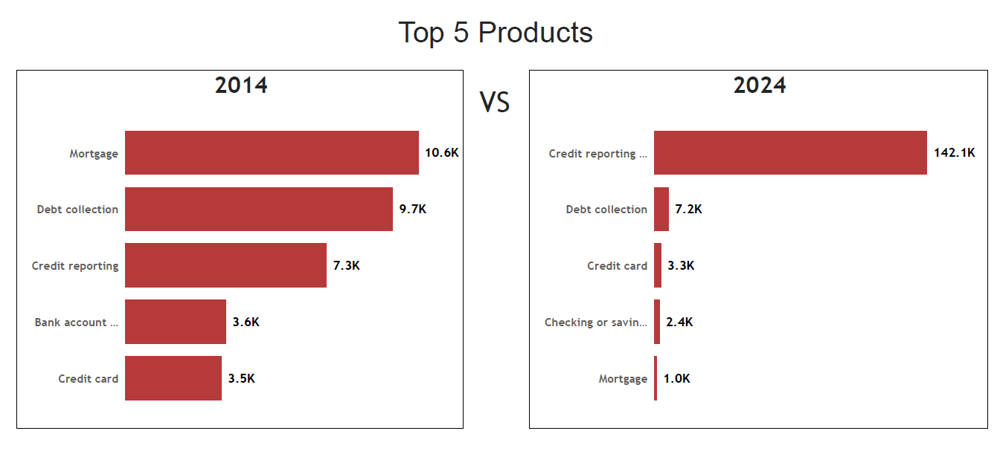
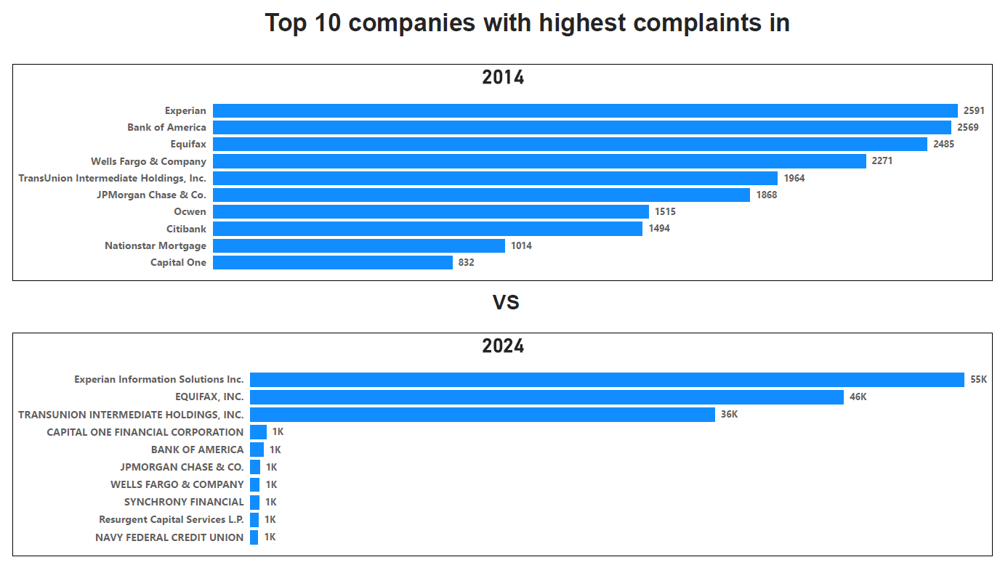
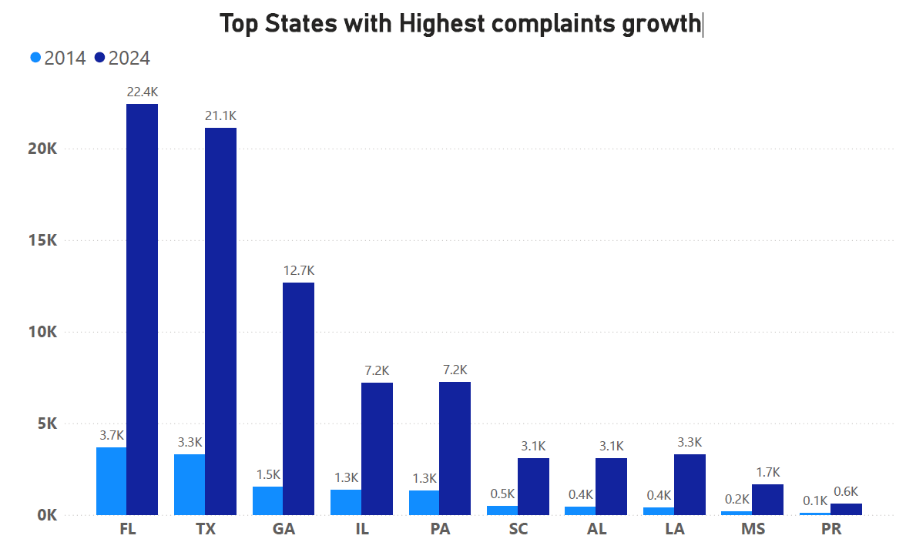

##  Analysis of Financial Complaints Filed by American Consumers: A Comparison of 2014 and 2024

The Consumer Financial Protection Bureau (CFPB - USA) collects complaints about consumer financial products and services, and sends them to companies for response. Complaints vary in a wide range of products.

Data are taken from (https://www.consumerfinance.gov/complaint/) 

### The questions I wanted to answer through my SQL queries exercise were:
1. What are the top product complaints of 2024 and 2014?
2. What are the new products which are not exist in 2014?
3. What are top 10 companies with highest complaints?
4. Which states have the highest complaints growth?

### Tools I Used
For my deep dive into consumer complaints data, I used several important tools:

- **SQL** 
- **PostgreSQL** 
- **Visual Studio Code** 
- **Git & GitHub** 

## The Analysis
Each query for this project aimed at investigating specific aspects of the data analyst. Here’s how I approached each question:

### 1. Top Product Complaints of 2014 and 2024

In 2014, the top product complaints were centered around financial products and services, with the highest complaints about mortgages, followed by debt collection and credit reporting. 

By 2024, the landscape of complaints shifted dramatically, especially in the category of credit reporting or other personal consumer reports, which saw a massive increase in complaints. Complaints related to debt collection and credit cards remained, though the number for debt collection dropped significantly. This data highlights a shift in consumer concerns, with a massive rise in issues related to personal credit reporting.

### 2. New Product

The products listed above were growth in the years following 2014. For example, "virtual currency" and "money services" became much more prominent with the rise of cryptocurrencies and "money transfer" services like PayPal made it easier to send money online. These changes show how technology and new trends have shaped financial products since 2014.

|New products|
|------------|
|Checking or savings account|
|Credit reporting or other personal consumer reports|
|Debt or credit management|
|Money transfer, virtual currency, or money service|
|Payday loan, title loan, personal loan, or advance loan|
|Vehicle loan or lease|

### 3. Top 10 Comapnies
The top three companies with the highest number of complaints in 2024 are Experian Information Solutions Inc. (55,478 complaints), Equifax Inc. (46,109), and TransUnion Intermediate Holdings Inc. (36,095), indicating a significant rise in complaint volumes compared to 2014. In 2014, the top complaint recipients were also Experian (2,591), Bank of America (2,569), and Equifax (2,485). This trend highlights a growing concern in consumer reporting agencies and credit-related services over the decade.

### 4. Top States with Highest complaints growth
The data highlights the top U.S. states that experienced the most significant growth in consumer complaints from 2014 to 2024. Louisiana (LA) tops the list with a remarkable increase, rising from 382 complaints in 2014 to 3,305 in 2024. It is closely followed by Mississippi, Georgia, and Alabama. These data suggest a dramatic rise in consumer dissatisfaction or reporting behavior in the Southern region. Notably, large states like Texas and Florida also show substantial absolute increases in complaints.

