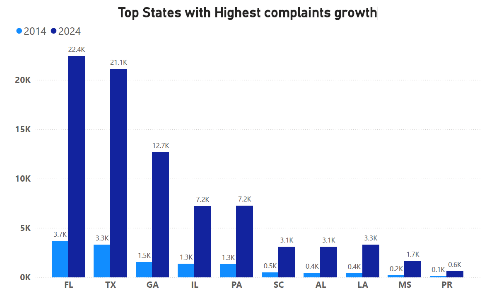

##  Analysis of a SQL database, containing finance complaints filed by american consumers, 2014 and 2024

The Consumer Financial Protection Bureau (CFPB - USA) collects complaints about consumer financial products and services, and sends them to companies for response. Complaints vary in a wide range of products.

Data are taken from (https://www.consumerfinance.gov/complaint/) 

### The questions I wanted to answer through my SQL queries exercise were:
1. What are the top product complaints of 2024 and 2014?
2. What are the new products which are not exist in 2014?
3. What are top 10 companies with highest complaints?
4. Which states have the highest complaints growth?

### Tools I Used
For my deep dive into consumer complaints data, I used several important tools:

- **SQL** 
- **PostgreSQL** 
- **Visual Studio Code** 
- **Git & GitHub** 

### 1. Top Product Complaints of 2014

### 1. Top Product Complaints of 2024

### 2. New Product

### 3. Top 10 Comapnies

### 4. Top States with Highest complaints growth

